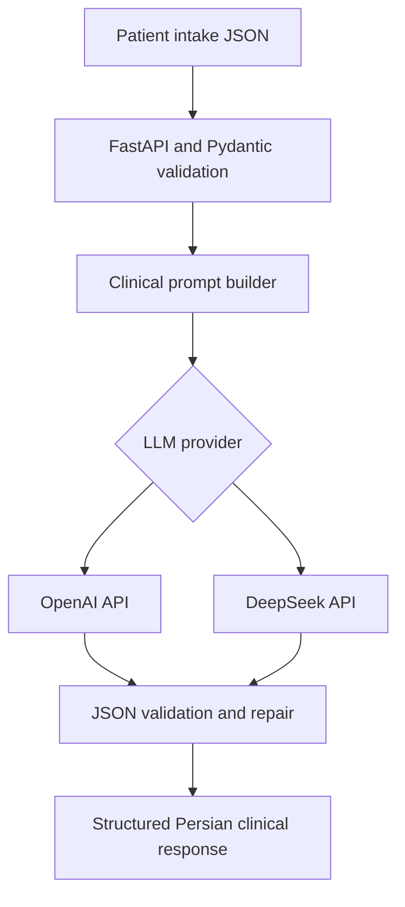

# Doctor's Assistant API - Multi-Provider LLM Deployment Guide


A production-oriented **FastAPI service** that converts raw patient intake data into concise, structured clinical summaries using multiple LLM providers:

- **OpenAI API:** GPT-4o, GPT-5, and GPT-5.1
- **DeepSeek API:** an OpenAI-compatible alternative provider for the same clinical workflow

The response is validated as Persian JSON with a fixed clinical schema and safety constraints.

> This system supports clinical documentation and triage workflows. It does not provide a final diagnosis and does not replace a physician's judgment.

## Use Cases

- Clinical intake summarization
- Physician-support applications
- Clinical triage assistants
- Hospital workflow automation
- Doctor-support chatbots
- Mobile and web health applications

## Project Structure

```text
ChatGPT-API-Doctor-Assistance/
|
|-- main.py                  # FastAPI application and endpoints
|-- bot_client.py            # GPT-5 client with schema enforcement
|-- gpt4o_bot_client.py      # GPT-4o client
|-- gpt5_1_bot_client.py     # GPT-5.1 client with usage logging
|-- requirements.txt         # Python dependencies
|-- docker-compose.yml       # Deployment orchestration
|-- Dockerfile               # Container build
|-- README.md
```

The public snapshot contains the OpenAI provider wrappers. The DeepSeek implementation was developed and evaluated as a parallel provider integration; provider-specific credentials and private deployment configuration are intentionally excluded.

## What the API Does

1. Receives raw patient data as JSON.
2. Validates the request with a Pydantic model.
3. Converts the intake fields into a normalized clinical prompt.
4. Calls the selected LLM provider.
5. Requires a strict Persian JSON response.
6. Parses, validates, and, when possible, repairs malformed JSON.
7. Returns the structured result through a REST endpoint.

The fixed response contract contains:

- <code>clinical_summary</code>
- <code>differential_dx</code>
- <code>next_steps</code>
- <code>suggested_specialist</code>
- <code>follow_up_questions</code>
- <code>red_flags</code>
- <code>when_to_seek_care</code>
- <code>handoff_notes</code>
- <code>safety_disclaimer</code>

## Architecture



## Provider Options

| Provider | Models / service | Main purpose |
|---|---|---|
| OpenAI | GPT-4o, GPT-5, GPT-5.1 | Structured clinical summarization with JSON mode |
| DeepSeek | OpenAI-compatible DeepSeek API; model configurable by deployment | Alternative provider for cost, availability, and quality comparison |

The provider layer is kept separate from the FastAPI intake and response contract, so the application can change models without changing the frontend integration.

## DeepSeek Integration

A separate DeepSeek-backed implementation was designed for the same doctor-assistance workflow. Its service design includes:

- an OpenAI-compatible DeepSeek API client;
- one shared client initialized during FastAPI startup;
- an asynchronous <code>/analyze</code> endpoint;
- execution of blocking SDK calls outside the event loop;
- a semaphore limiting concurrency to **20 in-flight requests**;
- a unique request ID for tracing;
- a **40-second per-request timeout**;
- strict JSON output for the Persian clinical response; and
- the same API-level validation and safety-oriented prompt rules.

Streaming is intentionally disabled. The application needs one complete JSON object before it can parse, validate, and return the clinical result safely.

The DeepSeek-specific source and credentials are not included in this public snapshot because the integration was evaluated in a separate professional environment.

## Reliability and Error Handling

The service includes several defensive layers:

- configurable API timeout;
- retry logic for connection, rate-limit, and provider-status errors;
- progressive delay between retries;
- detection of empty model responses;
- structured-output parsing;
- automatic repair for slightly malformed JSON;
- HTTP 502 for upstream model failures;
- HTTP 500 for unexpected application errors;
- request logging; and
- a dedicated health-check endpoint for deployment monitoring.

## Structured Output

The OpenAI implementation uses JSON response mode and parses the output before returning it to the caller. The prompt requires all nine response fields, Persian clinical formatting, descending differential-diagnosis likelihoods, and explicit red-flag guidance.

Function Calling is not used in the current version because the model does not need to invoke an external clinical tool. The product uses structured generation rather than tool execution.

## Token and Cost Control

- Responses are limited to approximately **800 tokens**.
- Differential diagnoses, follow-up questions, and next steps have explicit item limits.
- Prompts request concise, non-repetitive clinical language.
- The GPT-5.1 wrapper logs prompt, completion, total, and cached-token usage when available.
- GPT-4o and DeepSeek can be evaluated as alternative providers when cost or latency is more important.
- Provider selection is isolated from the application contract, enabling model comparison without frontend changes.

## Requirements

Install the public OpenAI-backed implementation:

```bash
pip install -r requirements.txt
```

Main dependencies include FastAPI, Uvicorn, Pydantic, and the OpenAI Python SDK.

## Environment Variables

```bash
export OUR_API_KEY="<YOUR_API_KEY>"
export MODEL="gpt-5.1"       # or gpt-5 / gpt-4o
export MAX_RETRIES=3
export OPENAI_TIMEOUT=120
```

DeepSeek credentials, base URL, and model name are configured separately in its deployment environment and are not committed to this repository.

## Run the API

### Development

```bash
uvicorn main:app --host 0.0.0.0 --port 8000 --workers 2
```

- API: <http://localhost:8000>
- Swagger UI: <http://localhost:8000/docs>

### Docker

```bash
docker build -t doctor-assistant-api .

docker run -d \
  -p 8000:8000 \
  -e OUR_API_KEY="<your-key>" \
  -e MODEL="gpt-5.1" \
  doctor-assistant-api
```

## API Endpoints

### Health Check

```http
GET /healthz
```

```json
{"status": "healthy"}
```

### Analyze Patient Data

```http
POST /analyze
Content-Type: application/json
```

Example request:

```json
{
  "age": 52,
  "sex": "female",
  "chief_complaint": "3-day history of pleuritic chest pain and cough.",
  "duration": 2,
  "past_medical_history": "HTN, type 2 diabetes",
  "medications": "lisinopril 20 mg qd, metformin 500 mg BID",
  "allergies": "penicillin (hives)",
  "social_history": "10 pack-years, quit 5 years ago",
  "temp": 37,
  "BP_S": 150,
  "BP_D": 80,
  "HR": 92,
  "SpO2": 98
}
```

Example response:

```json
{
  "message": "ok",
  "user_slots": "CC (chief complaint): ...",
  "bot_raw": {
    "clinical_summary": "خلاصه ساختاریافته اطلاعات بیمار...",
    "differential_dx": [],
    "next_steps": [],
    "suggested_specialist": "پزشک داخلی",
    "follow_up_questions": [],
    "red_flags": [],
    "when_to_seek_care": "...",
    "handoff_notes": "...",
    "safety_disclaimer": "..."
  }
}
```

## Project Status

The project reached an internally testable MVP / pre-production stage. The public repository demonstrates the OpenAI implementation and the overall multi-provider architecture. The DeepSeek variant was developed as a parallel integration for provider flexibility and concurrency-oriented API design.

No public high-traffic production metrics are claimed in this repository.

## Author

**Ali Ebrahimi**  
Data Analyst & AI Specialist  
PhD Candidate in Electrical Engineering - Electronics, University of Tehran

- [GitHub](https://github.com/ali-ebrahimii)
- [LinkedIn](https://www.linkedin.com/in/ali-ebrahimii/)
